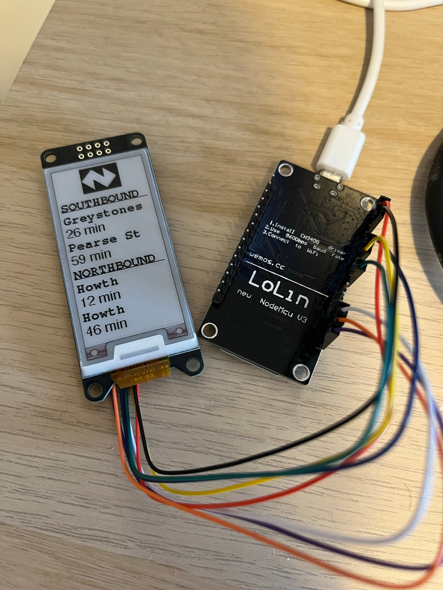

# Irish Rail DART Times on an ePaper Display
Display Irish Rail DART times on an ePaper Display using an ESP8266.

> Note this code is still very much in 'test', but it may help anyone looking at doing a similar project.

## Functionality

Run a tiny web server on an ESP8266 device connected to an ePaper display, parse JSON data sent via a HTTP POST request and display the contents on the connected display.

## Improvements
- Ideally this should work the other way around (i.e. the ESP8266 itself reaches out for the data) but for now I have a cron job set up to POST the data at regular intervals.

- The ability to define several WiFi networks, so that the ESP8266 can connect in various locations (home, office). Cycle through a list at boot and exit the loop once connected. (first step also a pre-requisite for this)


## Requirements

- Arduino IDE
- ePaper Display
  - I am using a WeAct 2.13" model from AliExpress, costs about €8.
- ESP8266 (likely workable on an ESP32 too with some tweaking)
- WiFI Network

## Example

- ESP8266 flashed with `dart.ino`.
- ESP8266 with local IP address of 192.168.0.100 on your WiFi network.

Send a POST request with the following data:

*POST Request*
```
curl -X "POST" "http://192.168.0.100/setMessage" \
     -H 'Content-Type: application/json; charset=utf-8' \
     -d $'{
  "dart_destination_4_time": "46 min",
  "dart_destination_2_time": "59 min",
  "dart_destination_1": "Greystones",
  "dart_destination_2": "Pearse St",
  "dart_destination_3": "Howth",
  "dart_destination_3_time": "12 min",
  "dart_destination_4": "Howth",
  "dart_destination_1_time": "26 min",
  "dart": "dart - value unused"
}'
```

*Response*

```
HTTP/1.1 200 OK
Content-Type: application/json
Content-Length: 40
Connection: close

Received data, sending to epaper display
```

*ePaper Display*

